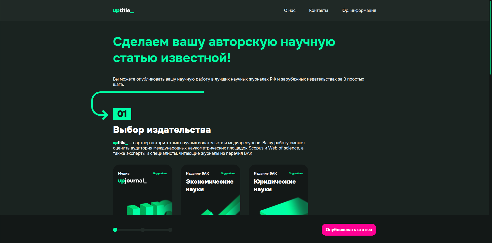
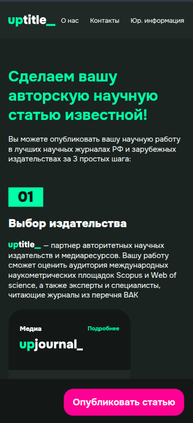

# 📰 Uptitle — Magazine Landing Page

A frontend development and layout project for a landing page designed to sell placements on an online magazine’s website.  
Built with **Gulp**, supports automated build, optimization, and live-reload.

---

## ✨ Preview

### Desktop version


### Mobile version


Live demo available at:  
👉 [https://makaksel.github.io/uptitle/](https://makaksel.github.io/uptitle/)

---

## 🛠 Technologies
- **HTML5**, **CSS3 (SCSS)**, **JavaScript (ES6)**
- **Gulp** — task runner
- **Flexbox / Grid** for layout
- **GitHub Pages** for deployment

---
## 📂 Project structure
```
uptitle/
├── docs/           # Documentation
├── gulp/           # Gulp build files
│ ├── config/       # Configuration files
│ └── tasks/        # Individual gulp tasks
├── src/            # Source code
│ ├── assets/       # Media (images, fonts, etc.)
│ ├── components/   # Interface components
│ ├── pages/        # Project pages
│ ├── scripts/      # JS
│ └── styles/       # Styles (SCSS/CSS)
└── gulpfile.js     # Build gulp

```
---


## ⚡ Installation & Usage
Clone the repository:
```bash
git clone https://github.com/makaksel/uptitle.git
cd uptitle
```

Install dependencies:
```bash
npm install
```

Run development server:
```bash
npm run dev
```

Build the project:
```bash
npm run build
```

***


# 📰 Uptitle — лендинга журнала

Проект по вёрстке и фронтенд-разработке лендинга для продаж размещения на сайте онлайн-журнала.  
Собран с помощью **Gulp**, поддерживает автоматическую сборку, оптимизацию и live-reload.

---

## ✨ Превью

### Десктопная версия


### Мобильная версия


Онлайн-версия доступна по ссылке:  
👉 [https://makaksel.github.io/uptitle/](https://makaksel.github.io/uptitle/)

---

## 🛠 Технологии
- **HTML5**, **CSS3 (SCSS)**, **JavaScript (ES6)**
- **Gulp** — сборщик проекта
- **Flexbox / Grid** для вёрстки
- **GitHub Pages** для публикации

---

## 📂 Структура проекта
```
uptitle/
├── docs/           # Документация
├── gulp/           # Файлы сборки gulp
│ ├── config/       # Конфигурационные файлы
│ └── tasks/        # Отдельные gulp-задачи
├── src/            # Исходный код проекта
│ ├── assets/       # Медиафайлы (изображения, шрифты и т.п.)
│ ├── components/   # Компоненты интерфейса
│ ├── pages/        # Страницы проекта
│ ├── scripts/      # JS
│ └── styles/       # Стили (SCSS/CSS)
└── gulpfile.js     # Сборка gulp

```
---

## ⚡ Установка и запуск
Склонировать репозиторий:
```bash
git clone https://github.com/makaksel/uptitle.git
cd uptitle
```

Установить зависимости:
```bash
npm install
```

Запустить режим разработки:
```bash
npm run dev
```

Запустить билд:
```bash
npm run build
```